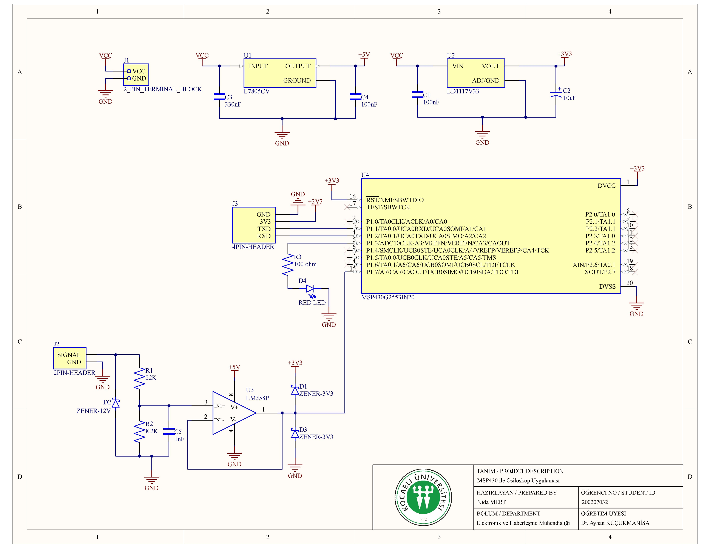
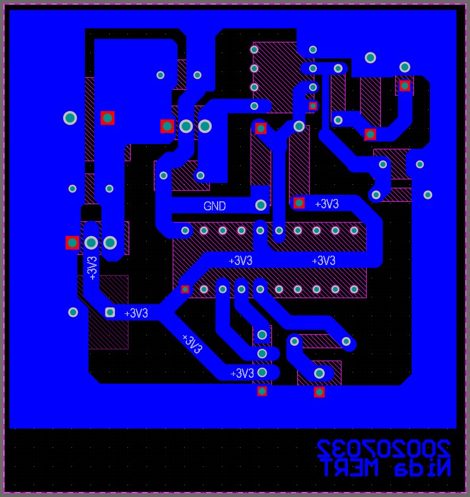
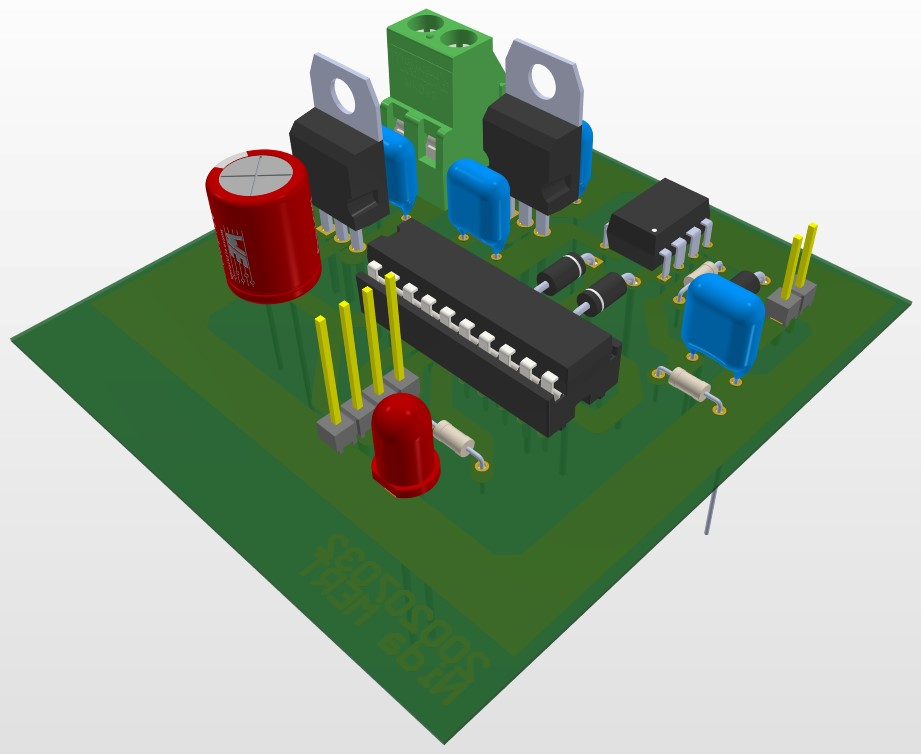
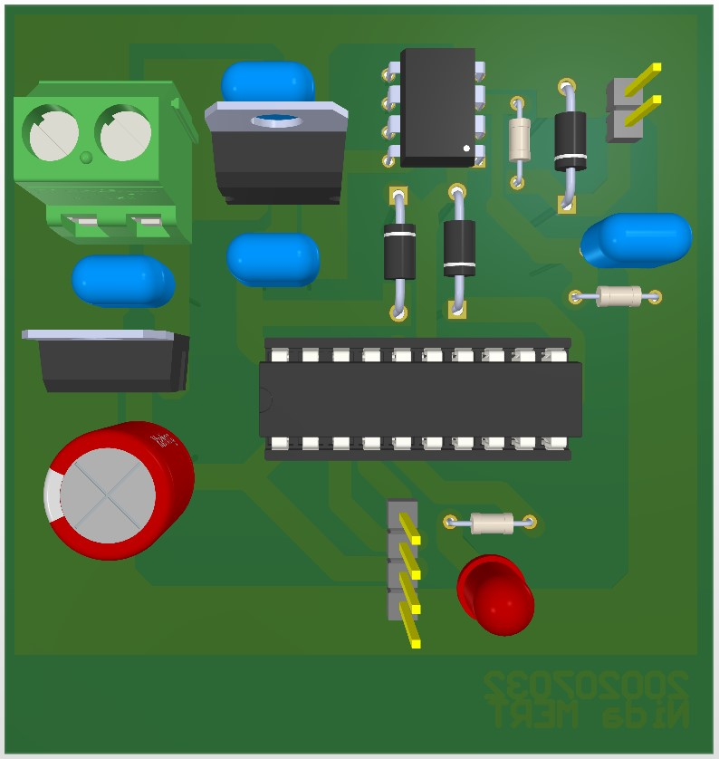
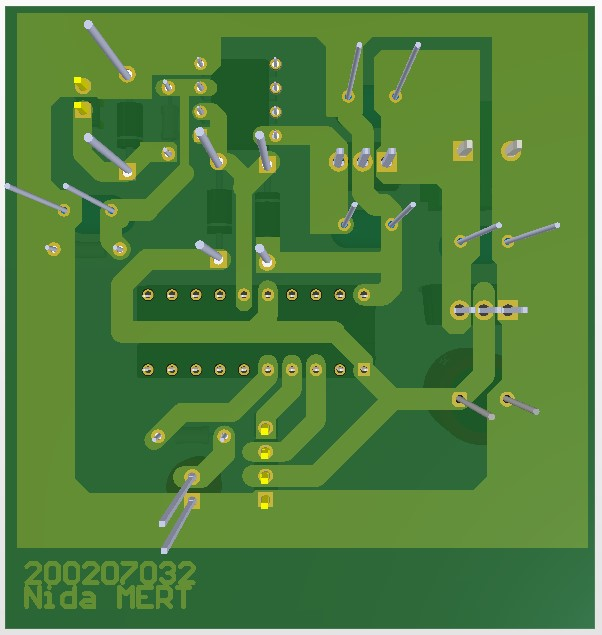
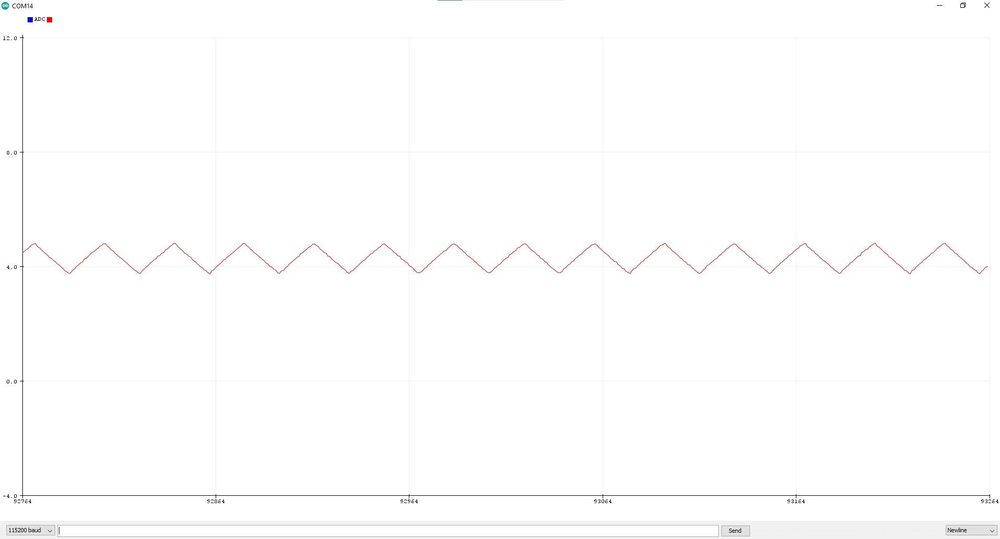

# MSP430 Oscilloscope Project

This project is a software-based oscilloscope application developed using the **MSP430G2553** microcontroller. Analog signals are sampled, transmitted to the computer via UART, and visualized using a Serial Plotter.

## 🔧 Hardware Requirements

- MSP430G2553 Launchpad (used for programming only)
- USB-to-TTL serial converter (for UART communication)
- Signal generator
- Serial plotting tool

## 💻 Software Features

- Analog signal sampling using ADC
- Periodic sampling via Timer
- Serial communication over UART (115200 baud)
- Visualization using Arduino Serial Plotter

## 📁 Project Structure

```
├── Oscilloscope/Osilloscope           → Altium Project Files
├── Oscilloscope_CCS                   → CCS Project Files
├── img                                → Project Images
├── LICENSE                            → License file
```

## 📷 Project Images










## ⚠️ Notice

This project is intended for personal use only. Unauthorized copying, downloading, redistribution, or use in other projects is **strictly prohibited**.

## 📄 License

All rights reserved © 2025 Nida Mert. See the `LICENSE` file for license details.